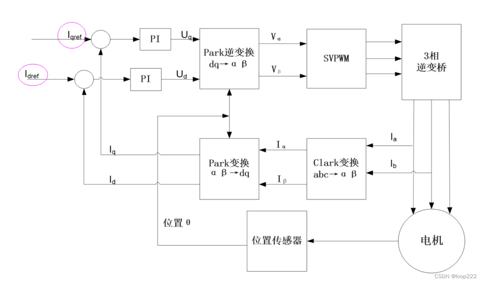

# ODrive v0.5.6 固件代码运行流程与关键函数解析

本文面向 ODrive v0.5.6、ODrive 3.6、STM32F405 的固件阅读。重点不是逐行翻译源码，而是解释这些函数在“采样 -> 控制 -> PWM 输出 -> 电机运动”链路中的位置，以及为什么要这样拆分。

主要代码入口：

| 模块 | 典型文件 | 作用 |
|---|---|---|
| 系统启动 | `MotorControl/main.cpp` | `main()`、配置加载、FreeRTOS 启动 |
| 板级初始化 | `Board/v3/board.cpp` | ODrive v3.x 外设、对象、TIM/ADC 同步 |
| CubeMX 外设 | `Board/v3/Src/*.c` | GPIO、ADC、TIM、SPI、CAN、USB 底层初始化 |
| 控制中断 | `Board/v3/board.cpp` | `TIM8_UP_TIM13_IRQHandler()`、`ControlLoop_IRQHandler()` |
| 电机 | `MotorControl/motor.cpp` | 电流采样、FOC 输入、PWM 写入、保护 |
| 编码器 | `MotorControl/encoder.cpp` | ABZ/Hall/SPI/sincos 采样与估算 |
| 控制器 | `MotorControl/controller.cpp` | 位置环、速度环、力矩命令 |
| FOC | `MotorControl/foc.cpp` | Clarke/Park、PI 电流环、SVPWM |
| 通信 | `communication/*` | USB/Fibre/ASCII/CAN 命令入口 |

## 1. 整体运行流程总览

```text
上电复位
  |
  v
启动汇编 / early_start_checks()
  |
  v
main()
  |
  +--> system_init()
  +--> 从 Flash/NVM 读取配置
  +--> board_init()
  |      +--> MX_GPIO_Init()
  |      +--> MX_DMA_Init()
  |      +--> MX_ADC1_Init() / MX_ADC2_Init() / MX_ADC3_Init()
  |      +--> MX_TIM1_Init() / MX_TIM8_Init()
  |      +--> MX_TIM3_Init() / MX_TIM4_Init()
  |      +--> MX_SPI3_Init()
  |      +--> MX_TIM2_Init() / MX_TIM5_Init() / MX_TIM13_Init()
  |      +--> 配置 ControlLoop_IRQn、EXTI、调试冻结、DRV 复位
  |
  +--> 按配置初始化 GPIO 模式
  +--> 创建 USB/CAN/UART 队列和信号量
  +--> 创建 FreeRTOS 默认任务 rtos_main
  +--> osKernelStart()
         |
         v
      rtos_main()
         |
         +--> MX_USB_DEVICE_Init()
         +--> start_general_purpose_adc()
         +--> init_communication()
         +--> axis.motor_.setup()
         +--> axis.encoder_.setup()
         +--> start_adc_pwm()
         |      +--> 初始 PWM = 50%
         |      +--> 使能 ADC
         |      +--> start_timers()
         |             +--> 同步启动 TIM1 / TIM8 / TIM13
         |             +--> 开启 TIM8 update 中断
         +--> start_analog_thread()
         +--> axes[i].start_thread()
                |
                v
             Axis 状态机线程

运行期硬实时链路：

TIM8 update 中断，约 16 kHz
  |
  v
TIM8_UP_TIM13_IRQHandler()
  |
  +--> 更新时间戳
  +--> counting up 时：Encoder::sample_now()
  +--> 触发 ControlLoop 软件中断
  +--> counting down 时：PWM 预置 50% 安全兜底
  |
  v
ControlLoop_IRQHandler()
  |
  +--> fetch_and_reset_adcs()
  +--> Motor::current_meas_cb()
  +--> ODrive::control_loop_cb()
  |      +--> Encoder::update()
  |      +--> Controller::update()
  |      +--> Motor::update()
  |      +--> FieldOrientedController::update()
  +--> 等待下一次 ADC
  +--> Motor::dc_calib_cb()
  +--> Motor::pwm_update_cb()
         |
         v
      FOC -> SVPWM -> TIM1/TIM8 CCR1/CCR2/CCR3
         |
         v
      三相桥 MOS 导通 -> 电机运行
```

整体设计可以分成三层：

| 层级 | 典型函数 | 设计目的 |
|---|---|---|
| 硬实时采样层 | `TIM8_UP_TIM13_IRQHandler()` | 只做最短路径：时间戳、编码器采样、触发软件中断 |
| 控制计算层 | `ControlLoop_IRQHandler()` / `ODrive::control_loop_cb()` | 运行电流采样处理、估算、控制环、PWM 计算 |
| 慢速任务层 | Axis 线程、USB/CAN 线程、analog 线程 | 状态机、通信、温度/模拟输入等非纳秒级时序任务 |

## 2. 上电启动阶段

### main()

位置：`MotorControl/main.cpp`

`main()` 是固件的 C/C++ 主入口。它不直接跑电机控制环，而是完成系统级准备：

1. 生成 USB 序列号。
2. 调用 `system_init()` 初始化时钟、Flash、HAL 基础功能。
3. 从 NVM 读取 `odrv`、Axis、Motor、Encoder、Controller 等配置。
4. 调用 `board_init()` 初始化 ODrive v3.x 板级外设。
5. 根据 `odrv.config_.gpio_modes[]` 配置用户 GPIO。
6. 创建 USB/CAN/UART 所需的 FreeRTOS 队列和信号量。
7. 创建 `rtos_main` 任务。
8. 调用 `osKernelStart()` 进入 FreeRTOS 调度。

它在电机控制链路中的位置：`main()` 只是“搭舞台”，真正的周期控制不在 `main()` 里跑，而是在 TIM8 硬件中断和 ControlLoop 软件中断里跑。

### board_init()

位置：`Board/v3/board.cpp`

核心调用：

```cpp
MX_GPIO_Init();
MX_DMA_Init();
MX_ADC1_Init();
MX_ADC2_Init();
MX_TIM1_Init();
MX_TIM8_Init();
MX_TIM3_Init();
MX_TIM4_Init();
MX_SPI3_Init();
MX_ADC3_Init();
MX_TIM2_Init();
MX_TIM5_Init();
MX_TIM13_Init();
```

作用：

| 函数 | 初始化内容 | 和电机控制的关系 |
|---|---|---|
| `MX_GPIO_Init()` | 芯片引脚默认状态 | 使能门极驱动、编码器引脚、故障输入、用户 GPIO |
| `MX_DMA_Init()` | DMA 控制器 | ADC1 普通通道 DMA、通信或外设搬运 |
| `MX_ADC1_Init()` | ADC1 | VBUS injected 采样，ADC1 普通通道后续被重配为 0-15 轮询 |
| `MX_ADC2_Init()` | ADC2 | 电流采样一路，regular 由 TIM8 TRGO 触发，injected 由 TIM1 TRGO 触发 |
| `MX_ADC3_Init()` | ADC3 | 电流采样另一路，配合 ADC2 采 B/C 两相电流 |
| `MX_TIM1_Init()` | TIM1 高级定时器 | M0 三相 PWM，TRGO 触发 M0 相关 ADC injected 采样 |
| `MX_TIM8_Init()` | TIM8 高级定时器 | M1 三相 PWM，TRGO 触发 M1 相关 ADC regular 采样，并产生主控制节拍 |
| `MX_TIM3_Init()` | TIM3 编码器接口 | M0 ABZ 增量编码器计数 |
| `MX_TIM4_Init()` | TIM4 编码器接口 | M1 ABZ 增量编码器计数 |
| `MX_SPI3_Init()` | SPI3 | DRV8301 和 SPI 绝对值编码器通信 |
| `MX_TIM2_Init()` | TIM2 | 制动电阻 PWM |
| `MX_TIM5_Init()` | TIM5 | PWM 输入捕获 |
| `MX_TIM13_Init()` | TIM13 | 与 TIM1/TIM8 同步的辅助定时 |

`board_init()` 还配置：

| 操作 | 作用 |
|---|---|
| `HAL_NVIC_SetPriority(ControlLoop_IRQn, 5, 0)` | 给控制环软件中断设置低于 TIM8 的优先级 |
| `__HAL_DBGMCU_FREEZE_TIM1/TIM8/TIM13()` | 调试暂停时冻结 PWM 定时器，避免 CPU 停住但 PWM 继续跑 |
| 拉低/拉高 `EN_GATE` | 复位两个 DRV8301 门极驱动 |

### rtos_main()

位置：`MotorControl/main.cpp`

`rtos_main()` 是 FreeRTOS 启动后的主初始化任务：

| 步骤 | 作用 | 在控制链路中的位置 |
|---|---|---|
| `MX_USB_DEVICE_Init()` | 初始化 USB 设备 | 让 odrivetool/Fibre/ASCII 能访问对象 |
| `start_general_purpose_adc()` | ADC1 普通通道 0-15 DMA 轮询 | 温度、模拟输入、部分板载模拟量 |
| `init_communication()` | 启动 USB/UART/CAN 通信 | 接收 `requested_state`、`input_pos` 等命令 |
| `pwm0_input.init()` | PWM 输入捕获 | 外部 PWM 命令输入 |
| `axis.motor_.setup()` | 配置电流采样增益、限流等 | 电流环前置条件 |
| `axis.encoder_.setup()` | 配置编码器模式 | 位置/速度估算前置条件 |
| `start_adc_pwm()` | 使能 PWM、ADC、定时器 | 硬实时控制链路开始 |
| `start_analog_thread()` | 慢速模拟输入映射 | 非硬实时输入 |
| `axes[i].start_thread()` | 启动 Axis 状态机 | 执行校准、闭环等状态 |

## 3. ODrive 对象与核心模块初始化

### 对象关系

```text
ODrive odrv
  |
  +-- axes[0] / axes[1]
       |
       +-- Motor
       |    +-- GateDriver: Drv8301
       |    +-- current_control_: FieldOrientedController
       |    +-- fet_thermistor_
       |    +-- motor_thermistor_
       |
       +-- Encoder
       +-- Controller
       +-- SensorlessEstimator
       +-- OpenLoopController
       +-- TrapTraj
       +-- Endstop
```

### ODrive 主对象

位置：`MotorControl/main.cpp`

```cpp
ODrive odrv{};
```

`odrv` 是全局根对象，也是 odrivetool 看到的 `odrv0` 的固件侧根节点。通信层写对象字段，本质上就是写 `odrv` 下面的成员，例如：

```python
odrv0.axis0.requested_state = AXIS_STATE_CLOSED_LOOP_CONTROL
odrv0.axis0.controller.input_pos = 1.0
```

### Axis

位置：`Board/v3/board.cpp`、`MotorControl/axis.cpp`

Axis 是“一个电机轴”的管理对象。它不直接计算三相 PWM，而是组织状态机和子模块：

```text
Axis
  -> 负责状态切换、错误处理、看门狗、校准流程
  -> 调用 Motor 做电流与 PWM
  -> 调用 Encoder 做位置速度
  -> 调用 Controller 做位置/速度/力矩控制
```

### Motor

位置：`MotorControl/motor.cpp`

Motor 负责和功率级强相关的事情：

| 职责 | 典型函数 |
|---|---|
| 电流采样换算 | `phase_current_from_adcval()` |
| 电流测量回调 | `current_meas_cb()` |
| 零点偏置估计 | `dc_calib_cb()` |
| PWM 写入 | `pwm_update_cb()`、`apply_pwm_timings()` |
| 使能/失能功率级 | `arm()`、`disarm()` |
| 电流环参数 | `update_current_controller_gains()` |

### Encoder

位置：`MotorControl/encoder.cpp`

Encoder 负责把硬件计数或角度读数变成控制器需要的：

```text
机械位置 pos_estimate_
机械速度 vel_estimate_
电角度 phase_
电角速度 phase_vel_
```

### Controller

位置：`MotorControl/controller.cpp`

Controller 接收用户命令，例如 `input_pos_`、`input_vel_`、`input_torque_`，根据控制模式生成最终力矩命令 `torque_output_`。

### GateDriver

位置：`Board/v3/board.cpp`、`Drivers/DRV8301/*`

ODrive 3.6 使用 DRV8301。它负责驱动三相桥 MOS 的栅极、提供电流采样运放、故障检测等。本仓库当前有几处 DRV8301 检查被注释，并固定了 `actual_gain = 20.0f`，这意味着阅读时要注意：这份代码不是完全原版默认行为。

### Thermistor

位置：`MotorControl/thermistor.cpp`

温度限制器通过 ADC 普通通道读取热敏电阻电压，转换成温度，再影响可用电流或触发过温错误。它属于安全/限流链路，不直接决定 PWM 波形，但会影响 `effective_current_lim_`。

## 4. TIM1/TIM8 PWM 与 ADC 采样时序

### TIM1 和 TIM8 分工

在 `Board/v3/board.cpp`：

| 电机 | 定时器 | 作用 |
|---|---|---|
| M0 / axis0 | TIM1 | 三相 PWM，触发 M0 电流采样 |
| M1 / axis1 | TIM8 | 三相 PWM，触发 M1 电流采样，同时作为控制节拍中断源 |

`Motor motors[AXIS_COUNT]` 中：

```cpp
Motor 0 -> &htim1
Motor 1 -> &htim8
```

### 关键宏

位置：`Board/v3/Inc/main.h`、`Board/v3/Inc/board.h`

| 宏 | 当前值/含义 | 作用 |
|---|---|---|
| `TIM_1_8_CLOCK_HZ` | `168000000` | TIM1/TIM8 计数时钟 168 MHz |
| `TIM_1_8_PERIOD_CLOCKS` | `3500` | PWM 半周期计数上限 ARR |
| `TIM_1_8_RCR` | `2` | 重复计数器，每 3 个 update 产生一次有效更新事件 |
| `TIM1_INIT_COUNT` | `TIM_1_8_PERIOD_CLOCKS / 2 - 512` | TIM1 相对 TIM8 的启动相位偏移 |
| `CURRENT_MEAS_HZ` | `168 MHz / (2 * 3500 * 3) = 8000 Hz` | 完整电流控制周期频率 |

注意一个容易混淆的点：代码注释里有“TIM8 中断频率 16 kHz”的说法，但按当前宏计算：

```text
中心对齐一次完整上数+下数 = 2 * 3500 个 tick
RCR = 2，等于每 3 次 update 事件才触发一次中断/采样周期
CURRENT_MEAS_HZ = 168 MHz / (2 * 3500 * 3) = 8 kHz
```

如果只按 `168 MHz / 3500 / 3` 算，会得到 16 kHz，这是“半个三角波周期”的速率；而 `CURRENT_MEAS_HZ` 使用完整中心对齐周期，因此控制环按 8 kHz 理解更稳妥。阅读这份改动过的代码时，应以宏 `CURRENT_MEAS_HZ` 和实际示波/中断计数为准。

### 中心对齐 PWM

TIM1/TIM8 使用：

```cpp
TIM_COUNTERMODE_CENTERALIGNED3
```

中心对齐 PWM 的计数器会：

```text
0 -> ARR -> 0 -> ARR ...
```

这样做的原因：

1. 三相 PWM 对称，谐波更好。
2. 上数/下数阶段可以安排不同采样点。
3. 电流采样可以避开 MOS 开关瞬间的噪声。
4. 可以把低侧 MOS 导通窗口和 ADC 触发对齐。

### ADC 为什么和 TIM TRGO 绑定

位置：`Board/v3/Src/adc.c`

ADC2/ADC3 regular：

```cpp
hadc2.Init.ExternalTrigConv = ADC_EXTERNALTRIGCONV_T8_TRGO;
hadc3.Init.ExternalTrigConv = ADC_EXTERNALTRIGCONV_T8_TRGO;
```

ADC injected：

```cpp
sConfigInjected.ExternalTrigInjecConv = ADC_EXTERNALTRIGINJECCONV_T1_TRGO;
```

设计原因：电流采样必须发生在 PWM 周期中的精确时刻。若用软件触发 ADC，会有中断延迟和抖动；由 TIM TRGO 触发，采样点和 PWM 硬件同源，时序稳定。

### 为什么低侧采样需要下 MOS 导通

ODrive v3.x 是低侧 shunt 采样。相电流流过低侧 MOS 和采样电阻时，采样电阻上才有代表相电流的压降。

```text
相线电流 -> 低侧 MOS -> shunt resistor -> GND
                         |
                         v
                    运放 -> ADC
```

如果低侧 MOS 没导通，电流可能不经过 shunt，ADC 读数就不代表真实相电流。所以 `ControlLoop_IRQHandler()` 中如果检测到 PWM 没开：

```cpp
if (!(TIM1->BDTR & TIM_BDTR_MOE_Msk)) current0 = {0.0f, 0.0f};
if (!(TIM8->BDTR & TIM_BDTR_MOE_Msk)) current1 = {0.0f, 0.0f};
```

这是为了避免把无效电流送进 FOC。

## 5. TIM8_UP_TIM13_IRQHandler 中断函数解析

位置：`Board/v3/board.cpp`

`TIM8_UP_TIM13_IRQHandler()` 是最关键的硬实时入口。它负责“节拍和采样触发”，但不做完整控制计算。

### 逐步解析

| 代码/动作 | 作用 | 为什么这样设计 |
|---|---|---|
| `COUNT_IRQ(TIM8_UP_TIM13_IRQn)` | 统计中断次数 | 用于调试、性能统计、确认中断频率 |
| `__HAL_TIM_CLEAR_IT(&htim8, TIM_IT_UPDATE)` | 清除 TIM8 update 标志 | 不清除会反复进入同一个中断 |
| `bool counting_down = TIM8->CR1 & TIM_CR1_DIR` | 判断中心对齐计数方向 | 上数/下数对应 PWM 周期的不同采样区域 |
| `timer_update_missed = (counting_down_ == counting_down)` | 检查是否漏掉 update | 正常应上下交替，连续同方向说明错过硬实时节拍 |
| `motors[i].disarm_with_error(ERROR_TIMER_UPDATE_MISSED)` | 漏中断立即关 PWM | 电流环不能容忍漏节拍，否则 PWM 可能失控 |
| `timestamp_ += TIM_1_8_PERIOD_CLOCKS * (TIM_1_8_RCR + 1)` | 更新时间戳 | 给采样、估算、FOC 做时间对齐 |
| `odrv.sampling_cb()` | 快速采样编码器 | 编码器采样尽量贴近电流采样时间 |
| `NVIC->STIR = ControlLoop_IRQn` | 触发软件中断 | 把重计算移出最高优先级 TIM8 中断 |
| `CCR1/2/3 = ARR/2` | 下数阶段先预置 50% PWM | 如果控制环没及时完成，下一拍先回到中性占空比 |

### sampling_cb()

位置：`MotorControl/main.cpp`

```cpp
void ODrive::sampling_cb() {
    for (auto& axis: axes) {
        axis.encoder_.sample_now();
    }
}
```

它只做很短的事情：采样编码器当前硬件状态。注释明确要求：

1. 尽量固定执行时间。
2. 尽量少用 CPU。
3. 不调用 FreeRTOS API。
4. 不做耗时和不确定计算。

这就是为什么 TIM8 中断只负责硬实时节拍，不负责完整控制计算。

## 6. ControlLoop_IRQHandler 控制环软件中断解析

位置：`Board/v3/board.cpp`

`ControlLoop_IRQHandler()` 是 TIM8 中断触发的软件中断，优先级低于 TIM8，但高于通信任务。它承担主要控制计算。

### 逐步解析

| 步骤 | 代码/函数 | 作用 |
|---|---|---|
| 1 | `COUNT_IRQ(ControlLoop_IRQn)` | 统计控制环调用次数 |
| 2 | `uint32_t timestamp = timestamp_` | 固定本轮控制时间基准 |
| 3 | `fetch_and_reset_adcs(&current0, &current1)` | 读取 ADC1/2/3 采样结果并清标志 |
| 4 | 检查 `TIMx->BDTR & MOE` | PWM 未使能时将电流置 0 |
| 5 | `motors[0].current_meas_cb(...)` | M0 电流采样进入 Motor/FOC |
| 6 | `motors[1].current_meas_cb(...)` | M1 电流采样进入 Motor/FOC |
| 7 | `odrv.control_loop_cb(timestamp)` | 编码器更新、控制器更新、电流环更新 |
| 8 | `while (!(ADC2->SR & ADC_SR_EOC))` | 等待下一次 ADC regular 采样 |
| 9 | 再次 `fetch_and_reset_adcs()` | 读取用于零点校准的采样 |
| 10 | `dc_calib_cb()` | 更新 ADC 电流零点偏置 |
| 11 | `pwm_update_cb()` | 计算并写入下一周期 PWM |
| 12 | 检查 `timestamp_` | 判断控制环是否错过截止时间 |
| 13 | `ERROR_CONTROL_DEADLINE_MISSED` | 超时则 disarm |

### fetch_and_reset_adcs()

读取内容：

| ADC 数据 | 含义 |
|---|---|
| `ADC1->JDR1` | VBUS 电压 |
| `ADC2->JDR1` / `ADC3->JDR1` | M0 B/C 相电流 |
| `ADC2->DR` / `ADC3->DR` | M1 B/C 相电流 |

三相电流只测 B/C 两相，A 相由：

```text
Ia = -Ib - Ic
```

这是因为三相电机在无中性线场景下满足：

```text
Ia + Ib + Ic = 0
```

### 为什么不用 TIM8 中断直接跑控制环

原因主要是中断优先级和抖动控制：

| 放在 TIM8 中断里 | 拆到 ControlLoop 软件中断 |
|---|---|
| TIM8 中断执行时间很长 | TIM8 保持短小，采样节拍稳定 |
| 影响其他高优先级外设 | 复杂计算在较低优先级执行 |
| 不能安全调用部分 RTOS/CMSIS API | ControlLoop 注释说明可调用 CMSIS 函数 |
| 漏中断风险更高 | 可用 deadline 检查监控是否超时 |

## 7. 电流采样流程

### 硬件链路

```text
三相桥低侧 MOS
  |
  v
shunt resistor
  |
  v
DRV8301 内部/外部电流采样运放
  |
  v
ADC2 / ADC3
  |
  v
fetch_and_reset_adcs()
  |
  v
Motor::current_meas_cb()
  |
  v
FOC on_measurement()
```

### shunt resistor 的作用

shunt resistor 是小阻值采样电阻。相电流经过它时产生压降：

```text
Vshunt = Iphase * Rshunt
```

由于压降很小，需要运放放大后再给 ADC。

### SHUNT_RESISTANCE 与 actual_gain

位置：`Board/v3/Inc/board.h`、`MotorControl/motor.cpp`

`SHUNT_RESISTANCE` 表示采样电阻阻值。本仓库里 v3.4 以后为：

```cpp
#define SHUNT_RESISTANCE (1000e-6f)
```

`Motor::setup()` 中当前固定：

```cpp
float actual_gain = 20.0f;
phase_current_rev_gain_ = 1.0f / actual_gain;
```

ADC 到电流的大致链路：

```text
ADC 原始值
  -> 转换为运放输出电压
  -> 去掉 1.65V 中点
  -> 除以运放增益
  -> 除以 shunt 电阻
  -> 相电流
```

### current_meas_cb()

位置：`MotorControl/motor.cpp`

主要做：

| 步骤 | 作用 |
|---|---|
| 统计电流采样事件 | `n_evt_current_measurement_++` |
| 判断 DC 零点校准是否有效 | 避免未校准偏置进入 FOC |
| 减去 `DC_calib_` | 获得真实相电流 |
| `odrv.do_fast_checks()` | 快速母线电压等保护 |
| 电流限幅检查 | 超过 `effective_current_lim_ + margin` 则 disarm |
| `control_law_->on_measurement()` | 把 VBUS 和三相电流送入 FOC |

### 为什么 PWM 没开时电流设为 0

低侧采样依赖低侧 MOS 导通。PWM 没开时，采样路径不可靠。此时传入无效电流会让 FOC 初始化困难；因此代码在未使能 MOE 时把电流估计为 0。这不是物理上永远正确，而是启动和失能状态下的工程折中。

## 8. 编码器采样流程

### sample_now()

位置：`MotorControl/encoder.cpp`

`Encoder::sample_now()` 在 `ODrive::sampling_cb()` 中调用，属于 TIM8 硬实时链路。

| 编码器模式 | `sample_now()` 做什么 | 特点 |
|---|---|---|
| ABZ 增量 | 读取 `timer_->Instance->CNT` | TIM3/TIM4 硬件计数，速度快 |
| Hall | 不立即计算，只采 GPIO 端口快照 | Hall 状态较慢，后续 `update()` 解码 |
| sin/cos | 读取两个 ADC 普通通道 | 模拟正余弦位置 |
| SPI ABS | `abs_spi_start_transaction()` | 启动 SPI DMA/事务，后续完成 |

### update()

位置：`MotorControl/encoder.cpp`

`Encoder::update()` 在 `ODrive::control_loop_cb()` 中调用。它把 `sample_now()` 拿到的原始样本转换成控制量：

```text
原始计数/角度
  -> shadow_count_
  -> count_in_cpr_
  -> pos_estimate_
  -> vel_estimate_
  -> phase_
  -> phase_vel_
```

### ABZ / Hall / SPI 区别

| 类型 | 优点 | 缺点 | 常见用途 |
|---|---|---|---|
| ABZ 增量编码器 | 分辨率高、速度估算好 | 上电不知道绝对位置，需要 index 或 offset 校准 | 伺服控制 |
| Hall | 接线简单、低成本 | 只有 6 个电角度状态，低速抖动大 | BLDC 简单控制、粗定位 |
| SPI 绝对值 | 上电有绝对角度 | SPI 时序和协议复杂 | 高性能伺服 |
| sin/cos | 连续模拟角度 | 需要 ADC 精度和标定 | 特定模拟编码器 |

编码器数据最终给：

| 数据 | 使用者 |
|---|---|
| `pos_estimate_` | 位置环 |
| `vel_estimate_` | 速度环 |
| `phase_` | FOC Park / inverse Park |
| `phase_vel_` | FOC 相位预测 |

## 9. 控制器流程

位置：`MotorControl/controller.cpp`

ODrive 控制结构可以理解为级联环：

```text
位置命令 input_pos
  |
  v
位置环：位置误差 * pos_gain
  |
  v
速度目标 vel_des
  |
  v
速度环：速度误差 * vel_gain + 积分
  |
  v
力矩目标 torque
  |
  v
电流目标 Iq_setpoint
  |
  v
FOC 电流环
  |
  v
Vd/Vq
  |
  v
SVPWM
  |
  v
三相 PWM
```

### Controller::update()

主要步骤：

| 阶段 | 作用 |
|---|---|
| 读取估算量 | 位置、速度、环绕位置等 |
| 处理 input mode | passthrough、vel ramp、torque ramp、pos filter、trap traj 等 |
| 位置环 | 根据 `pos_setpoint_ - pos_estimate` 生成速度目标 |
| 速度限幅 | 限制 `vel_des` |
| 速度环 | 根据速度误差生成力矩 |
| 力矩限幅 | 不超过 Motor 当前可用力矩 |
| 输出 | 写 `torque_output_`，供 `Motor::update()` 使用 |

### 位置环、速度环、电流环关系

| 环 | 输入 | 输出 | 文件 |
|---|---|---|---|
| 位置环 | 位置误差 | 速度目标 | `controller.cpp` |
| 速度环 | 速度误差 | 力矩/电流目标 | `controller.cpp` |
| 电流环 | 电流误差 | 电压指令 Vd/Vq | `foc.cpp` |
| PWM 调制 | 电压矢量 | CCR 占空比 | `foc.cpp` + `motor.cpp` |

FOC 的基本思想：把三相交流量转换到跟随转子旋转的 d/q 坐标系，在这个坐标系里电流近似为直流量，PI 控制器就能稳定控制转矩。

## 10. PWM 更新流程

### pwm_update_cb()

位置：`MotorControl/motor.cpp`

```text
Motor::pwm_update_cb(output_timestamp)
  |
  +--> control_law_->get_output()
  |      |
  |      +--> FieldOrientedController::get_alpha_beta_output()
  |      |      +--> Park transform
  |      |      +--> d/q 电流 PI
  |      |      +--> inverse Park transform
  |      |
  |      +--> SVM(mod_alpha, mod_beta)
  |
  +--> pwm_timings[0..2] * TIM_1_8_PERIOD_CLOCKS
  |
  +--> apply_pwm_timings()
         |
         +--> TIMx->CCR1 = phase A
         +--> TIMx->CCR2 = phase B
         +--> TIMx->CCR3 = phase C
```

### SVPWM

位置：`MotorControl/foc.cpp`

`AlphaBetaFrameController::get_output()` 调用：

```cpp
auto [tA, tB, tC, success] = SVM(mod_alpha, mod_beta);
```

SVPWM 的作用是把二维电压矢量转换成三相桥占空比。它比简单正弦 PWM 更充分利用母线电压，并能自然生成零矢量窗口，便于电流采样。

### CCR1/CCR2/CCR3 与上下桥 MOS

TIM1/TIM8 是高级定时器，每相有互补输出：

```text
CH1  / CH1N -> A 相上桥 / 下桥
CH2  / CH2N -> B 相上桥 / 下桥
CH3  / CH3N -> C 相上桥 / 下桥
```

`CCR1/2/3` 决定每相比较点，从而决定上/下桥在一个 PWM 周期内的导通时间。

### 为什么需要 deadtime

同一相的上桥和下桥不能同时导通，否则母线会被直接短路。deadtime 是上下桥切换之间强制插入的空白时间：

```text
上桥关断 -> 等待 deadtime -> 下桥导通
下桥关断 -> 等待 deadtime -> 上桥导通
```

deadtime 太短会直通，太长会造成电压误差和电流畸变。ODrive 通过 TIM 高级定时器的 break/deadtime 单元处理这个硬件级安全要求。

## 11. Axis 状态机流程

位置：`MotorControl/axis.cpp`

### requested_state_ 如何驱动状态切换

`Axis::run_state_machine_loop()` 是每个 Axis 独立线程执行的状态机。外部命令通常写：

```python
odrv0.axis0.requested_state = AXIS_STATE_CLOSED_LOOP_CONTROL
```

固件侧流程：

```text
requested_state_ 被写入
  |
  v
run_state_machine_loop() 发现 requested_state_ != UNDEFINED
  |
  v
生成 task_chain_
  |
  v
requested_state_ 清回 UNDEFINED
  |
  v
按 task_chain_ 依次执行状态处理函数
  |
  v
成功则进入下一个状态，失败则回 IDLE 并置错误
```

### 常见状态

| 状态 | 作用 | 进入条件/重点 |
|---|---|---|
| `AXIS_STATE_IDLE` | 空闲，PWM 不驱动 | 默认安全状态 |
| `AXIS_STATE_STARTUP_SEQUENCE` | 启动序列 | 根据配置决定是否自动校准、找 index、闭环 |
| `AXIS_STATE_FULL_CALIBRATION_SEQUENCE` | 完整校准 | 电机校准 + 编码器校准 |
| `AXIS_STATE_MOTOR_CALIBRATION` | 电机参数校准 | 需要测相电阻/相电感等 |
| `AXIS_STATE_ENCODER_OFFSET_CALIBRATION` | 编码器相位偏移校准 | FOC 必须知道电角度和编码器角度关系 |
| `AXIS_STATE_CLOSED_LOOP_CONTROL` | 闭环控制 | 要求电机已校准，编码器方向有效或启用无感 |

### 状态机和控制环的关系

状态机线程不是 8 kHz 控制环。它负责“让系统进入某种模式”。例如进入闭环后，真正每个周期执行位置环、速度环、电流环的仍然是 `ControlLoop_IRQHandler()` 和 `ODrive::control_loop_cb()`。

## 12. odrivetool / USB / CAN 命令如何影响电机

### USB / odrivetool 路径

位置：`communication/interface_usb.cpp`、`communication/communication.cpp`

```text
odrivetool
  |
  v
USB CDC / native USB
  |
  v
usb_rx_process_packet()
  |
  v
usb_server_thread()
  |
  v
Fibre / ASCII protocol
  |
  v
autogen endpoints
  |
  v
写入 odrv / axis / controller / motor 对象字段
```

例如：

```python
odrv0.axis0.requested_state = AXIS_STATE_CLOSED_LOOP_CONTROL
```

最终写入：

```cpp
axes[0].requested_state_
```

状态机线程随后执行闭环状态。

再例如：

```python
odrv0.axis0.controller.input_pos = 1.0
odrv0.axis0.controller.input_vel = 0.0
odrv0.axis0.controller.input_torque = 0.0
```

最终影响：

```text
Controller::update()
  -> pos_setpoint_/vel_setpoint_/torque_setpoint_
  -> torque_output_
  -> Motor::update()
  -> Idq_setpoint_ / Vdq_setpoint_
  -> FOC
  -> PWM
```

### CAN 路径

位置：`communication/can/can_simple.cpp`

典型回调：

| CAN 回调 | 写入对象 | 影响 |
|---|---|---|
| `set_axis_requested_state_callback()` | `axis.requested_state_` | 切换 Axis 状态 |
| `set_input_pos_callback()` | `controller.input_pos_/input_vel_/input_torque_` | 位置命令 |
| `set_input_vel_callback()` | `controller.input_vel_/input_torque_` | 速度命令 |
| `set_input_torque_callback()` | `controller.input_torque_` | 力矩命令 |
| `set_controller_modes_callback()` | `control_mode/input_mode` | 改变控制模式 |
| `set_limits_callback()` | `vel_limit/current_lim` | 改变限幅 |

CAN 命令并不直接写 PWM。它只写控制目标或状态请求，最终仍由 8 kHz 控制环统一生成 PWM。

## 13. 关键函数速查表

| 函数名 | 所在模块 | 作用 | 重要程度 | 初学者理解重点 |
|---|---|---|---|---|
| `main()` | `MotorControl/main.cpp` | 系统入口，加载配置，启动 FreeRTOS | 高 | 它不跑控制环，只负责初始化 |
| `system_init()` | 板级/系统层 | 时钟、Flash、HAL 基础初始化 | 中 | 所有外设依赖系统时钟 |
| `board_init()` | `Board/v3/board.cpp` | 初始化 ODrive v3.x 外设 | 高 | TIM/ADC/SPI/GPIO 都在这里准备 |
| `MX_TIM1_Init()` | `Board/v3/Src/tim.c` | 初始化 M0 PWM 定时器 | 高 | TIM1 对应 axis0/M0 |
| `MX_TIM8_Init()` | `Board/v3/Src/tim.c` | 初始化 M1 PWM 定时器和控制节拍 | 高 | TIM8 是主中断节拍 |
| `MX_ADC1_Init()` | `Board/v3/Src/adc.c` | VBUS injected 采样初始配置 | 高 | 后续 ADC1 普通通道会被重配 |
| `MX_ADC2_Init()` | `Board/v3/Src/adc.c` | 电流采样 ADC2 | 高 | regular/injected 分别服务 M1/M0 |
| `MX_ADC3_Init()` | `Board/v3/Src/adc.c` | 电流采样 ADC3 | 高 | 与 ADC2 组成 B/C 相采样 |
| `rtos_main()` | `MotorControl/main.cpp` | FreeRTOS 主初始化任务 | 高 | 通信、Motor/Encoder setup、PWM 启动 |
| `start_general_purpose_adc()` | `MotorControl/low_level.cpp` | ADC1 0-15 普通通道 DMA 轮询 | 中 | 温度和模拟输入，不是主电流采样 |
| `start_adc_pwm()` | `MotorControl/low_level.cpp` | 使能 PWM、ADC、定时器 | 高 | 从这里开始硬实时链路 |
| `start_timers()` | `Board/v3/board.cpp` | 同步启动 TIM1/TIM8/TIM13 | 高 | 保证 PWM 和 ADC 相位关系 |
| `TIM8_UP_TIM13_IRQHandler()` | `Board/v3/board.cpp` | 硬实时节拍中断 | 最高 | 只做短小确定的采样触发 |
| `ODrive::sampling_cb()` | `MotorControl/main.cpp` | 快速编码器采样 | 高 | 把编码器采样贴近电流采样 |
| `ControlLoop_IRQHandler()` | `Board/v3/board.cpp` | 控制环软件中断 | 最高 | 电流、估算、控制、PWM 更新主链路 |
| `fetch_and_reset_adcs()` | `Board/v3/board.cpp` | 读取 ADC 电流和 VBUS | 高 | 两相采样推三相 |
| `Motor::phase_current_from_adcval()` | `MotorControl/motor.cpp` | ADC 原始值转电流 | 高 | ADC -> 电压 -> 电流 |
| `Motor::current_meas_cb()` | `MotorControl/motor.cpp` | 电流测量处理并送 FOC | 最高 | 电流限幅和 FOC 输入 |
| `Motor::dc_calib_cb()` | `MotorControl/motor.cpp` | 电流零点偏置估计 | 高 | 没有零点校准电流会偏 |
| `ODrive::control_loop_cb()` | `MotorControl/main.cpp` | 周期控制总调度 | 最高 | Encoder、Controller、Motor、FOC 的顺序 |
| `Encoder::sample_now()` | `MotorControl/encoder.cpp` | 读取编码器原始样本 | 高 | 在 TIM8 中断附近执行 |
| `Encoder::update()` | `MotorControl/encoder.cpp` | 位置/速度/电角度估算 | 高 | FOC 需要 `phase_` |
| `Controller::update()` | `MotorControl/controller.cpp` | 位置/速度/力矩控制 | 高 | 用户命令到力矩输出 |
| `Motor::update()` | `MotorControl/motor.cpp` | 力矩/电流/电压命令整理 | 高 | Controller 输出进入 FOC 前的转换 |
| `FieldOrientedController::update()` | `MotorControl/foc.cpp` | 锁存本轮 FOC 输入 | 高 | 保证 FOC 使用同一轮数据 |
| `FieldOrientedController::on_measurement()` | `MotorControl/foc.cpp` | 保存电流和母线电压测量 | 高 | 电流环的反馈输入 |
| `FieldOrientedController::get_alpha_beta_output()` | `MotorControl/foc.cpp` | FOC 核心计算 | 最高 | Clarke/Park/PI/inverse Park |
| `SVM()` | FOC/数学模块 | 空间矢量调制 | 高 | 电压矢量转三相占空比 |
| `Motor::pwm_update_cb()` | `MotorControl/motor.cpp` | 计算并写 PWM | 最高 | 控制计算落到 TIM CCR |
| `Motor::apply_pwm_timings()` | `MotorControl/motor.cpp` | 写 TIMx CCR1/2/3 | 最高 | 最终改变 MOS 导通时间 |
| `Axis::run_state_machine_loop()` | `MotorControl/axis.cpp` | Axis 状态机 | 高 | requested_state 驱动校准/闭环 |
| `init_communication()` | `communication/communication.cpp` | 启动 USB/UART/CAN | 中 | 命令入口 |
| `CANSimple::set_input_pos_callback()` | `communication/can/can_simple.cpp` | CAN 位置命令 | 中 | CAN 不直接控 PWM，只写目标 |
| `usb_rx_process_packet()` | `communication/interface_usb.cpp` | USB 收包入口 | 中 | odrivetool 命令进入固件 |

## 14. 初学者阅读源码建议

推荐按“从主干到细节”的顺序读：

1. `MotorControl/main.cpp`
   先看 `main()` 和 `rtos_main()`，理解系统从上电到启动任务的顺序。

2. `Board/v3/board.cpp`
   看全局对象构造、`board_init()`、`start_timers()`，建立“ODrive 3.6 板上有哪些硬件资源”的地图。

3. `MotorControl/axis.cpp`
   看 `Axis::run_state_machine_loop()`，理解 `requested_state_` 如何变成校准、闭环、空闲。

4. `MotorControl/motor.cpp`
   重点看 `setup()`、`current_meas_cb()`、`dc_calib_cb()`、`pwm_update_cb()`、`apply_pwm_timings()`。

5. `MotorControl/encoder.cpp`
   重点看 `sample_now()` 和 `update()`，理解原始编码器数据如何变成位置、速度、电角度。

6. `MotorControl/controller.cpp`
   看 `Controller::update()`，理解 `input_pos/input_vel/input_torque` 如何变成力矩命令。

7. `Board/v3/board.cpp` 的 `TIM8_UP_TIM13_IRQHandler()`
   理解硬实时节拍、方向判断、漏中断保护、软件中断触发。

8. `Board/v3/board.cpp` 的 `ControlLoop_IRQHandler()`
   把电流采样、控制计算、PWM 更新串起来看。

9. `MotorControl/foc.cpp`
   最后看 FOC 数学：Clarke、Park、PI、电压调制、SVPWM。

阅读时建议始终抓住一条主线：

```text
用户命令
  -> Controller 生成力矩/电流目标
  -> Encoder 提供角度和速度
  -> ADC 提供相电流和 VBUS
  -> FOC 生成电压矢量
  -> SVPWM 生成三相占空比
  -> TIM1/TIM8 CCR 更新
  -> MOS 导通时间改变
  -> 电机相电流改变
  -> 转矩改变
```

只要这条链路清楚，ODrive 固件的大部分源码都能放回正确的位置。


FOC原理：



```
1. 给定目标 Iqref / Idref
   通常 Idref = 0，Iqref = 目标力矩电流

2. ADC 采电机三相电流 Ia/Ib/Ic

3. Clark 变换：
   Ia/Ib/Ic → Iα/Iβ

4. 编码器提供转子角度 θ

5. Park 变换：
   Iα/Iβ + θ → Id/Iq

6. 计算误差：
   Idref - Id
   Iqref - Iq

7. PI 控制：
   电流误差 → Ud/Uq

8. Park 逆变换：
   Ud/Uq + θ → Vα/Vβ

9. SVPWM：
   Vα/Vβ → 三相 PWM 占空比

10. 三相逆变桥：
    PWM → 三相电压 → 电机

11. 电机电流变化，再次被 ADC 采样
```

